# Get started managing your architecture with SonarQube

> Last verified: May 2026

## TL;DR overview

* SonarQube Cloud generates an interactive architecture map from your source code at every analysis, showing your project's current architecture.
* Users can decide on the components for which they wish to manage architecture, and where they sit in the overall application structure.
* Users can define an allow-list of permitted relationships between components; non-defined relationships are forbidden. Optionally, users can define the interface for the components.
* On the next analysis, SonarQube compares actual structure, relationships, and interfaces against the intended architecture and reports differences as deviations, with code-level issues pointing to the exact references to fix.

The [Architecture management capability](https://docs.sonarsource.com/sonarqube-cloud/architecture/) in [SonarQube Cloud](https://www.sonarsource.com/products/sonarqube/cloud/) analyzes your codebase's current project architecture and presents it as an interactive map. You can then define your intended architecture that describes which component relationships are permitted and, optionally, specify which children of a component [are accessible from outside](https://community.sonarsource.com/t/interface-design-in-sonarqube-architecture/179858). [SonarQube](https://www.sonarsource.com/products/sonarqube/) compares the two and reports the differences as code-level [maintainability](https://www.sonarsource.com/solutions/maintainability/) issues that can count toward your quality gate's maintainability rating.

Software architectures erode over time dependencies grow unchecked, cycles form between components, and changes become harder to make safely. AI-generated code accelerates this: agents write functionally correct code that silently violates architectural boundaries they can't see. Architecture management gives teams a way to detect and prevent this architectural decay.

Architecture management operates on three concepts:

- **Current architecture** — reverse-engineered from your source code at every analysis; it shows the actual component hierarchy and relationships.
- **Intended architecture** — an allow-list of relationships that *you* define; everything not explicitly allowed is forbidden.
- **Deviations** — the difference between current and intended architectures; surfaced as SonarQube issues at the code level.

This guide walks through each of these using Microsoft's [GCToolKit](https://github.com/microsoft/gctoolkit) (`microsoft/gctoolkit`). Fork it, import it into SonarQube Cloud, and run an analysis to follow along. You'll open and read the architecture map, define an intended architecture, and inspect deviations.

## 1 — Exploring the current architecture

The current architecture is updated automatically at every analysis, so it is always current and includes every new code commit. Open the **Architecture** tab in your project sidebar and you'll see four sections: **Current Architecture**, **Intended Architecture**, **Deviations,** and **Flaws**:

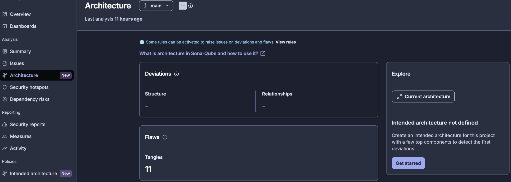

Click into **Current Architecture** to open the **architecture map**:

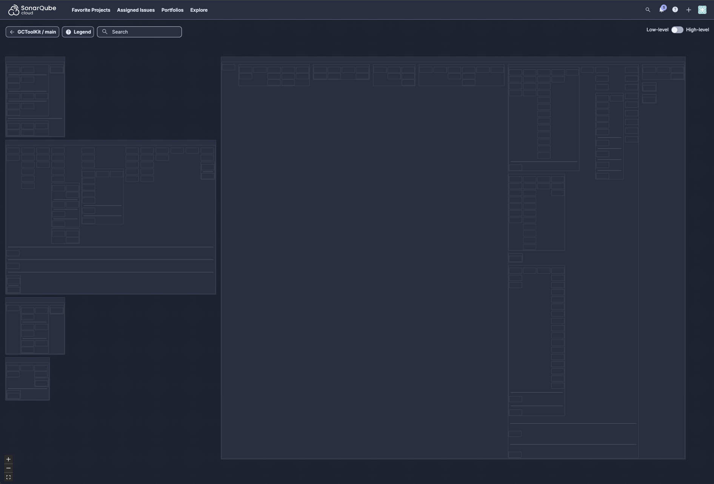

### Reading the architecture map

This is a visual representation of your codebase's actual component structure and relationships; a couple things to understand about how it's organized:

**Containment reflects structure:** Code units (classes, files) sit inside their containing components (packages, folders, namespaces, etc.), which sit inside higher-level components. The exact terms depend on the language but the hierarchy functions the same way, and the size of each container roughly reflects the amount of code it contains.

**Layout is driven by relationships:** The map uses a levelized arrangement:

- Items on the far right likely have no outgoing relationships.
- Each column has at least one dependency on the column to its right.
- Items in the same column have no relationships with each other.
- Relationships generally flow from left to right.

### Navigating the map

The architecture map supports a few ways to explore:

**Click any item** to see its specific relationships. Click a class and you'll see arrows to every other class it uses or is used by, including across package and module boundaries. This is how you trace a single component's relationships through the codebase:

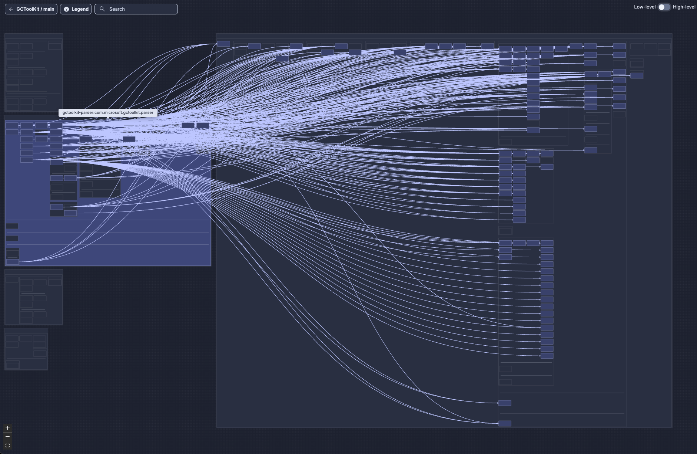

**High-level mode:** When you click a module, the number of individual dependency arrows can make the view unreadable. Switch to high-level mode (toggle in the UI) and the individual arrows between child components are collapsed into single arrows between their parent containers, giving you a cleaner view of the top-level relationships without the noise of every underlying dependency. You can then click a specific package within the module to narrow the view to solely *that* package's external relationships:

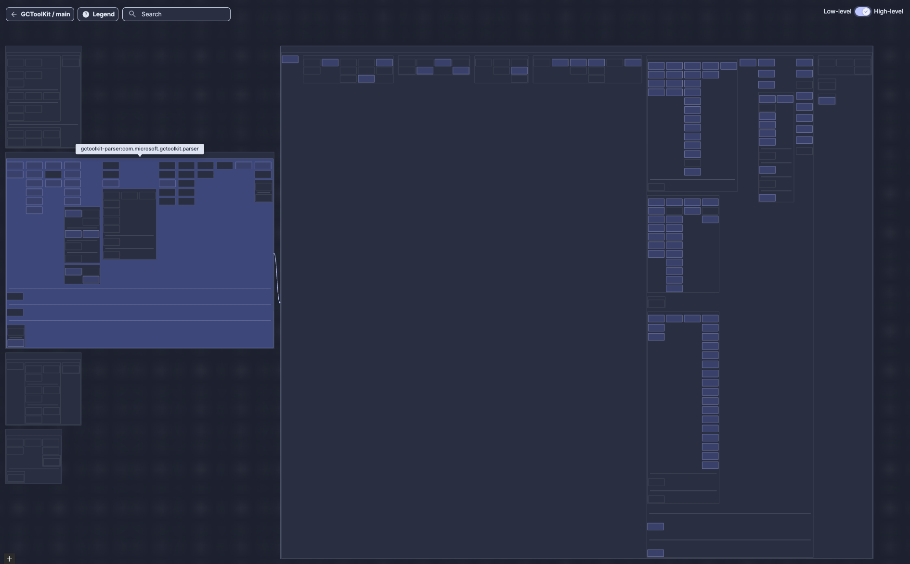

**Pan and zoom:** zoom in to see class names and detailed structures; zoom out to see the full dependency picture. When relationships go off-screen, pan to follow them, or zoom out to see where they lead. This allows you to trace relationships across your entire codebase:

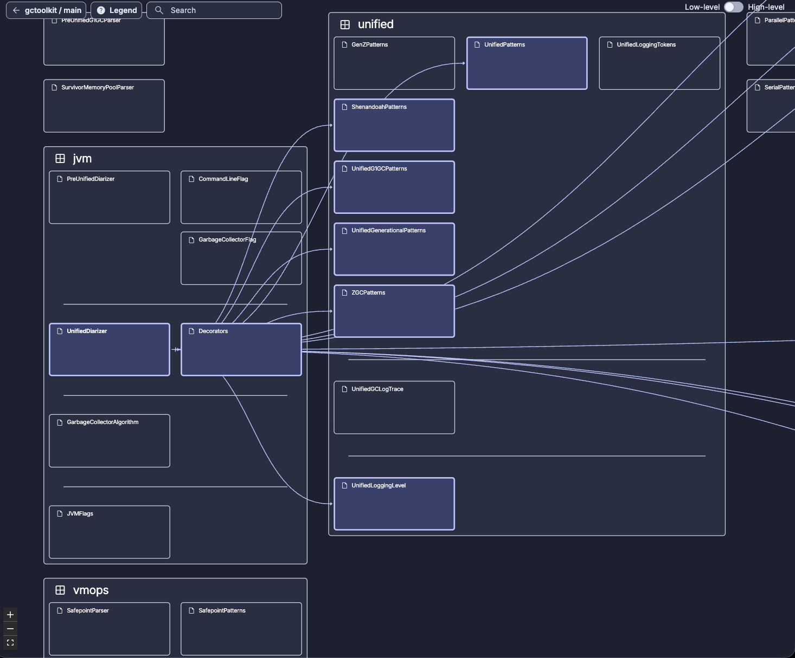

### What the map tells you (before you define anything)

Before defining your architecture, the current architecture map already lets you:

- Understand the module and package structure of your codebase
- Identify hub components that everything depends on
- Spot feedback relationships (right-to-left arrows) that indicate potential structural issues
- See coupling patterns through container density and whitespace
- Make sense of cohesion from the map's visual structure (wide rows indicate higher cohesion and deeper columns indicate low cohesion)

## 2 — Defining the intended architecture

The current architecture shows you what exists but the **intended architecture** lets you define what *should* exist, and then detects when the code deviates from that intent.

Navigate to **Intended Architecture** in the Architecture dashboard. On a first visit, you'll find one box for each language found in your codebase. As GCToolKit is a pure Java project, there's a single Java box:

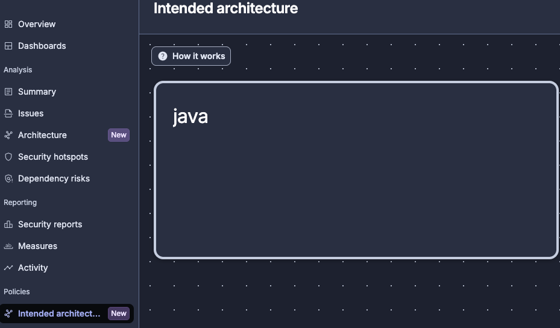

**Permissions:** Defining the intended architecture requires the proper "Administer Architecture" permission; without this, the editor is read-only. Viewing the architecture map and deviations, however, does not require special permission. Configure permissions as needed:

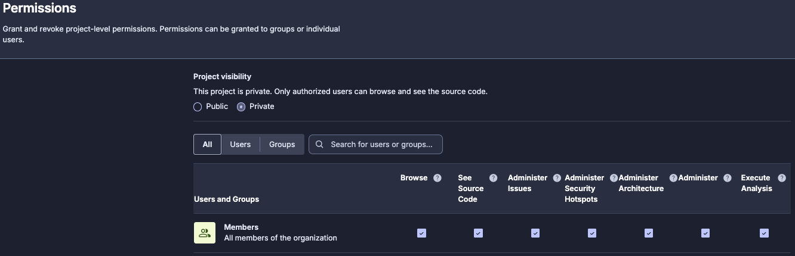

### How the intended architecture definition works

Before adding anything to the editor, it's important to understand some rules that govern how intended architecture behaves. These rules ensure that the model is unambiguous:

| Rule | What it means |
| :---- | :---- |
| **Top-down** | Start from the top level and work down. You can't define a sub-package without first defining its parent module. |
| **Only what you add is verified** | Anything not present in the model is ignored during analysis. You don't need to model your entire application; start with what matters most. |
| **Allow-list only** | You define which relationships are allowed; everything not defined is forbidden. There is no way to explicitly mark a relationship as forbidden; the way to forbid it is simply not to define it. |
| **Sibling-only relationships** | You can only draw relationships between siblings (components at the same level under the same parent). Cross-parent relationships, such as a package in one module depending on a package in another, are handled through inheritance from the parent-level relationship you've already defined. |
| **Inherited by sub-components** | If module A is allowed to depend on module B, every class in A can reference any class in B. The relationship cascades down the containment hierarchy. |
| **Not transitive** | If A→B is allowed and B→C is allowed, A→C is *not* automatically allowed. You must define A→C explicitly, otherwise it's forbidden. |

### Adding top-level components

Click to add your top-level modules to the model. For GCToolKit, add three modules to start:

1. `api`
2. `integration`
3. `parser`

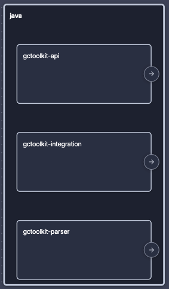

### Defining allowed relationships

With the modules in place, draw the allowed relationships:

- `parser` → `api`
- `integration` → `api`

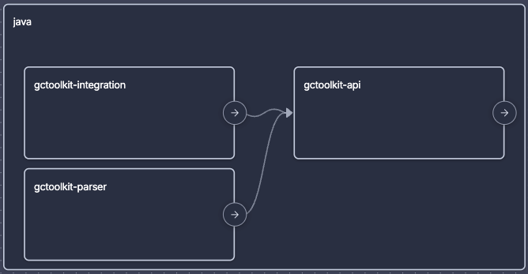

That's it; by not drawing anything else, you've effectively said:

- `api` → `parser`: **forbidden** (not defined)
- `api` → `integration`: **forbidden** (not defined)
- `integration` → `parser`: **forbidden** (not defined)
- `parser` →`integration`: **forbidden** (not defined)

### Going deeper: package-level definitions

You can go even deeper within a given module. Inspect a module to see its packages, then add specific packages to the model and define their sibling relationships.

For example, inside one of GCToolKit's modules, you might add the packages `jvm`, `unified`, and `vmops`, and then define:

- `jvm` → `unified` **(allowed)**
- `vmops` → (nothing): `vmops` has no allowed relationships with `jvm` or `unified`

You can only draw relationships between sibling components at the same level, under the same parent. Any more-distant relationships are already governed by the parent-level definitions:

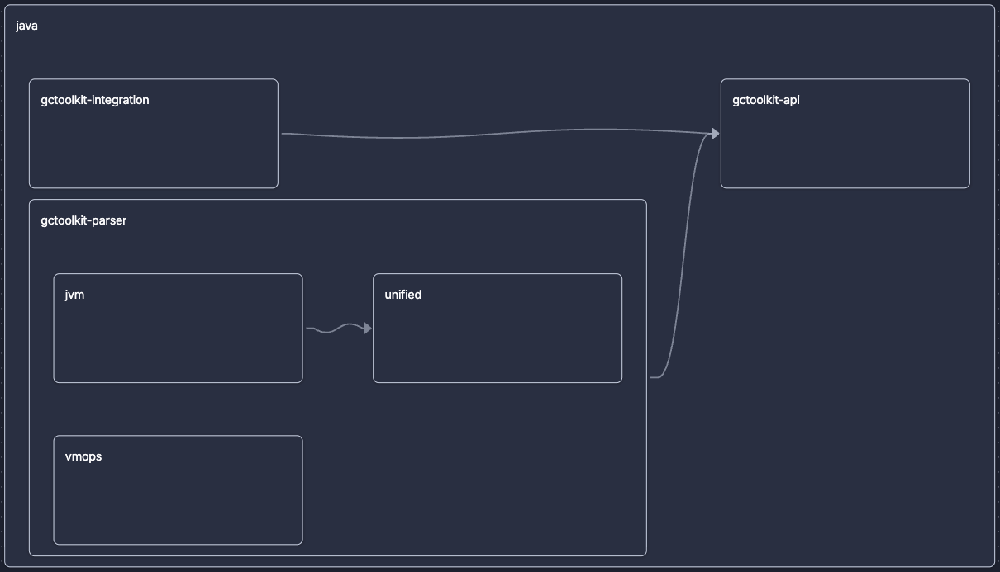

### Saving the changes

Changes are not applied until you click **Save**. The next analysis (after saving) will compare the actual code against your model. If you skip the save, the analysis runs against the previous state.

**Anti-pattern: modeling everything at once.** Don't try to map your entire application in the first pass. Instead, start with the top-level modules and the relationships that matter most. Extend the model incrementally once the initial deviations are resolved as the intended architecture is designed for iterative refinement.

## 3 — Detecting deviations

After saving your intended architecture, run a new analysis. When it completes, navigate to the **Deviations** section of the Architecture dashboard:

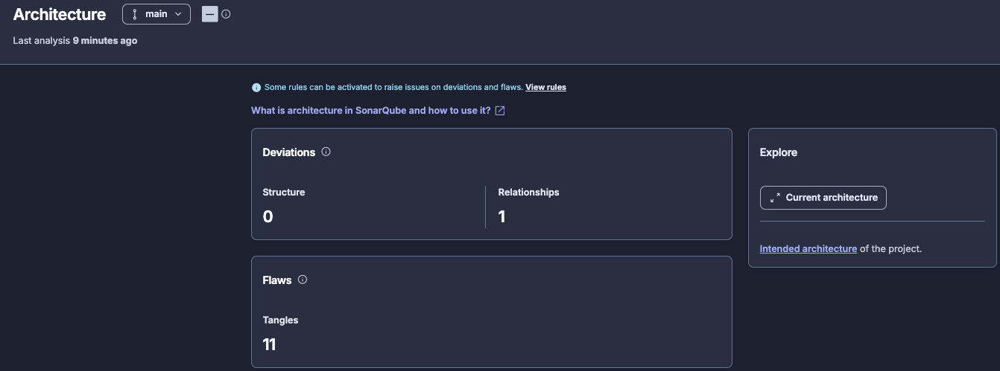

### Relationships deviations

Deviations are places where the actual code doesn't match your intended architecture. Each one identifies a dependency that exists in the code but isn't in your allow-list.

For GCToolKit, you might see a deviation from the `integration` module to the `parser` module: something in `integration` references something in `parser`, and since you didn't define that relationship in your intended model, it's flagged.

Click any deviation to see the SonarQube issues it generates. This is where the two-level issue structure matters:

- The **architecture issue** is the high-level finding: "module A should not have a relationship to module B."
- The **code-level issues** are the specific import statements, method calls, or type references that create that relationship. One architecture issue might produce multiple code-level issues.

A software developer doesn't need to open the Architecture dashboard. Architecture deviations surface as standard SonarQube maintainability issues in the project issues list and [quality gate](https://www.sonarsource.com/resources/library/quality-gate/), the same places you already look for [bugs](https://www.sonarsource.com/resources/library/what-is-bug-detection/) and [code smells](https://www.sonarsource.com/resources/library/code-smells/).

Open your analysis summary and click on **New Issues**:

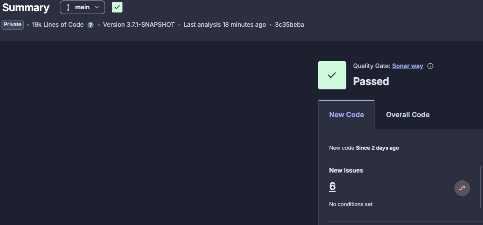

Inspect the list of issues that have arisen:

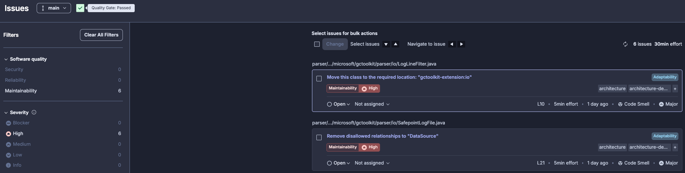

And examine a given issue:

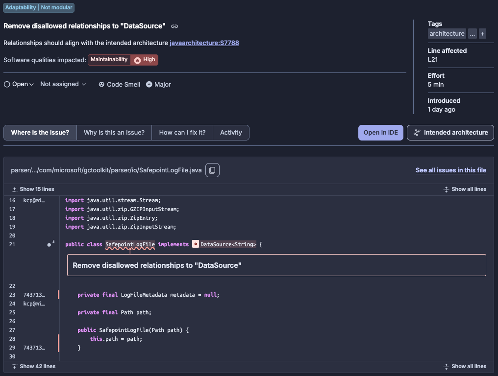

### Architecture deviations

The intended architecture editor also supports structural operations by way of the context menu on any component:

**Placeholder:** create a module that doesn't yet exist in the codebase. For GCToolKit, you might add a new planned module (e.g., `extension`) and define its relationships. If you position it so that only `api` can access it, other modules would need to go through `api` to reach any functionality in the extension. When code is eventually added to the new module, the relationships you defined are already enforced.

**Move:** select an existing package (e.g., `io`) and move it to a different module in the model. This expresses the intent that the code should be relocated; SonarQube issues will guide software developers to perform the actual move.

**Rename:** change the name of a component in the model. SonarQube issues will reference the intended new name.

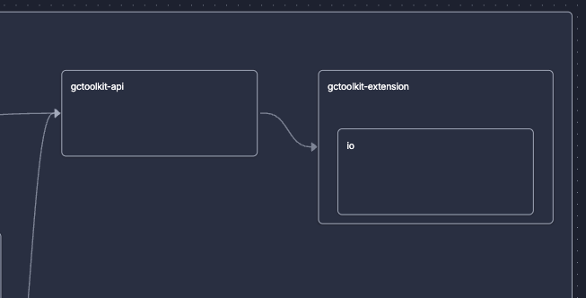

After saving and re-analyzing, structural changes appear in the **Deviations** dashboard alongside relationships deviations:

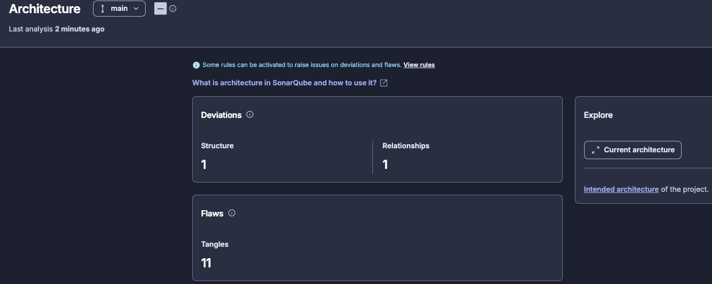

You can inspect any issues that have arisen as a result of the structural changes. As noted earlier, a software developer can bypass the Architecture dashboard entirely and inspect issues directly from the analysis summary:

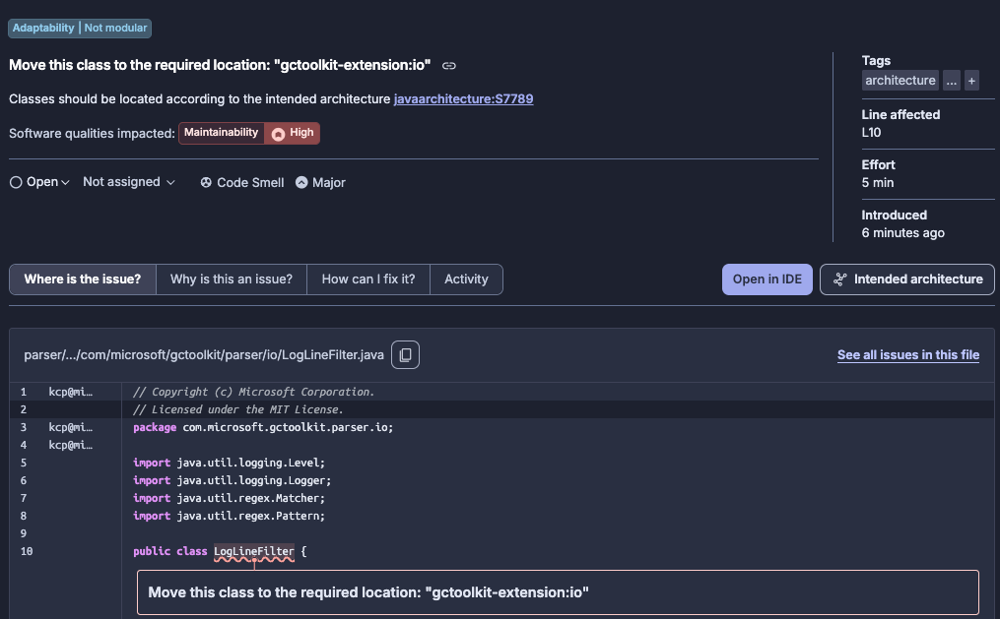

### How deviations become actionable

Architecture issues flow through the standard SonarQube workflow:

- They appear in dashboards and issue lists
- They count toward the maintainability rating and can break quality gates
- Each architecture-level finding generates code-level issues that point developers to the exact lines to fix

## What to know

- **Plans:** available on all SonarQube Cloud plans at no additional cost.
- **Supported languages:** [Java](https://www.sonarsource.com/knowledge/languages/java/), [JavaScript](https://www.sonarsource.com/knowledge/languages/js/), [TypeScript](https://www.sonarsource.com/knowledge/languages/ts/), [Python](https://www.sonarsource.com/knowledge/languages/python/), and [C#](https://www.sonarsource.com/knowledge/languages/csharp/).
- **Analysis required:** any change to the intended architecture takes effect only after the next analysis. Saving the model alone is not enough; a new scan must run before issues are raised based on deviations.
- **Project size limit:** architecture analysis is designed for projects up to approximately 800k lines of code.

## Summary

Architecture management allows you to:

- **Discover** your actual architecture through the architecture map, which reverse-engineers your codebase automatically on every analysis.
- **Formalize** what the architecture should look like by defining components, allowed relationships, and interface boundaries.
- **Prioritize** the gaps between current and intended architectures to address deviations.
- **Fix** problems through your existing workflow, where they surface in quality gates and issues lists.

The model is designed for incremental adoption, so start with a few top-level components, define their relationships, resolve the deviations that appear, and then extend from here. Remember that you don't need to map your entire application on the first pass.

For more details, see the [official architecture docs](https://docs.sonarsource.com/sonarqube-cloud/architecture/) and the [community resources hub](https://community.sonarsource.com/t/resources-for-architecture-management-in-sonarqube/177657).
